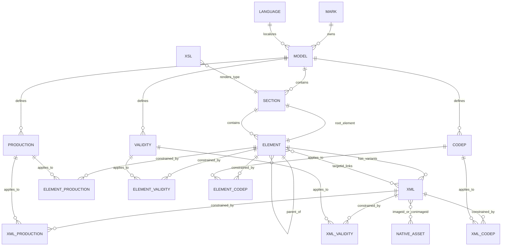

# eLearn Database Schema

## Scope and method

This report covers the eight Microsoft Jet/Access databases under `D:\database`. Because the mounted disc is read-only and Jet attempts to create lock files, each database was copied byte-for-byte to a temporary analysis directory, source/copy SHA-256 hashes were compared, and the copy was opened with Microsoft ACE OLE DB 16.0 using `Mode=Read`.

No database was repaired, compacted, relinked, or written. The source hashes are recorded in `MOUNTED_ELEARN_DISC_ANALYSIS.md`.

## Database organization

All eight databases have the same application schema signature:

```text
B454CFF285127336129A86D30772CEDE28D31DCDCBD45E50244342D342BACC6B
```

Each has 22 application tables, 104 application columns, zero linked tables, and no provider-exposed foreign-key constraints. They are standalone language databases:

| File | Content language ID | Language |
|---|---:|---|
| `elearn_1.dat` | 1 | Italian |
| `elearn_2.dat` | 2 | English |
| `elearn_3.dat` | 3 | German |
| `elearn_4.dat` | 4 | Spanish |
| `elearn_5.dat` | 5 | French |
| `elearn_6.dat` | 6 | Dutch |
| `elearn_7.dat` | 7 | Portuguese (`Portoguese` in the source table) |
| `elearn_9.dat` | 9 | Polish |

The common `LANGUAGE` table also lists Czech (8), Greek (10), and Turkish (11), but no corresponding content databases exist on this disc.

## Table catalog and columns

| Table | Columns | Purpose |
|---|---|---|
| `MARK` | `ID`, `NAME`, `LINK`, `LINKCONT`, `CODE` | Brand metadata and brand-specific CSS paths |
| `MODEL` | `ID`, `LANGUAGE_ID`, `MARK_ID`, `NAME`, `CODE` | Vehicle model metadata |
| `MODEL_IMAGE` | `ID`, `LANGUAGE_ID`, `IMAGE_LINK`, `IMAGE_LINK_OFF`, `AGGIORNAMENTO` | Model-selection image metadata |
| `LANGUAGE` | `ID`, `NAME`, `CODE`, `SET_CODE`, `INTERNALSEARCH` | Supported language and Windows character set |
| `SECTION` | `ID`, `LANGUAGE_ID`, `MODEL_ID`, `ROOT_ELEM_ID`, `NAME`, `TYPE`, `ORDERS`, `CLICCABLE`, `INDENT` | Six top-level technical sections and their root nodes |
| `ELEMENT` | `ID`, `SECTION_ID`, `PARENT_ID`, `LANGUAGE_ID`, `NAME`, `CODE`, `ORDERS`, `ALL_CODEP`, `ALL_VALIDITY`, `ALL_PRODUCTION`, `LAYOUT` | Hierarchical navigation/content nodes |
| `XML` | `ID`, `ELEMENT_ID`, `LANGUAGE_ID`, `VALUE_XML`, `ORDERS`, `ALL_CODEP`, `ALL_VALIDITY`, `ALL_PRODUCTION`, `FULL_TEXT` | Source technical XML and search text |
| `PRODUCTION` | `ID`, `LANGUAGE_ID`, `MODEL_ID`, `NAME`, `CODE`, `VALIDITY_ID` | Date/range applicability dimensions |
| `VALIDITY` | `ID`, `LANGUAGE_ID`, `MODEL_ID`, `NAME`, `CODE`, `ORDERS` | Engine/version applicability dimensions |
| `CODEP` | `ID`, `LANGUAGE_ID`, `MODEL_ID`, `NAME`, `CODE` | Option/equipment applicability (ABS, climate control, ESP, BiPower, etc.) |
| `ELEMENT_PRODUCTION` | `ELEMENT_ID`, `PRODUCTION_ID` | Element-to-production applicability |
| `ELEMENT_VALIDITY` | `ELEMENT_ID`, `VALIDITY_ID` | Element-to-engine/version applicability |
| `ELEMENT_CODEP` | `ELEMENT_ID`, `CODEP_ID` | Element-to-option applicability |
| `XML_PRODUCTION` | `XML_ID`, `PRODUCTION_ID` | XML-variant production applicability |
| `XML_VALIDITY` | `XML_ID`, `VALIDITY_ID` | XML-variant engine/version applicability |
| `XML_CODEP` | `XML_ID`, `CODEP_ID` | XML-variant option applicability |
| `ELEMENT_IMAGE` | `ELEMENT_ID`, `IMAGE_ID` | Reserved image bridge; empty in every database |
| `XSL` | `ID`, `SECTION_TYPE`, `LANGUAGE_ID`, `XSL` | Section-type to XSL renderer mapping |
| `STRING` | `ID`, `LANGUAGE_ID`, `STRING` | Localized application strings |
| `VERSION` | `VERSION` | Database version string (`0.0.0`) |
| `MVS` | `ID`, `MODELLO`, `VERSIONE`, `SERIE`, `MARK_ID`, `MODEL_ID`, `VALIDITY_ID` | Reserved model/version/series table; empty |
| `SERVICENEWS` | `XML_ID`, `CodiceServiceNews`, `SottotitoloServiceNews`, `InconvenienteServiceNews`, `VersioneServiceNews`, `CampagnaID`, `Gruppo`, `Sottogruppo`, `Complessivo` | Reserved service-news metadata; empty |

`VALUE_XML`, `STRING`, and several service-news fields are Jet long-text/memo fields. Text encoding is language-dependent and declared in `LANGUAGE.SET_CODE` (`windows-1252`, `windows-1250`, `windows-1253`, or `windows-1254`).

## Primary keys

Provider-reported primary keys are composite in several language-aware tables:

| Table | Primary key |
|---|---|
| `MARK` | `ID` |
| `LANGUAGE` | `ID` |
| `MODEL` | (`ID`, `LANGUAGE_ID`) |
| `MODEL_IMAGE` | (`ID`, `LANGUAGE_ID`) |
| `SECTION` | (`ID`, `LANGUAGE_ID`, `MODEL_ID`) |
| `ELEMENT` | (`ID`, `PARENT_ID`, `LANGUAGE_ID`) |
| `XML` | (`ID`, `ELEMENT_ID`, `LANGUAGE_ID`) |
| `PRODUCTION` | (`ID`, `LANGUAGE_ID`) |
| `VALIDITY` | (`ID`, `LANGUAGE_ID`, `MODEL_ID`) |
| `CODEP` | (`ID`, `LANGUAGE_ID`, `MODEL_ID`) |
| `STRING` | (`ID`, `LANGUAGE_ID`) |
| `XSL` | `ID` |
| Applicability/image bridge tables | Composite key of their two ID columns |

No foreign keys are declared in the Jet catalogs. The relationships below are inferred from column names and verified against actual records.

## Row counts by language database

### Core content

| Database | Element nodes | XML records | Sections | Production | Validity | CODEP | Model rows |
|---|---:|---:|---:|---:|---:|---:|---:|
| Italian `_1` | 4,899 | 7,220 | 6 | 6 | 2 | 21 | 8 |
| English `_2` | 5,111 | 7,177 | 6 | 6 | 2 | 21 | 8 |
| German `_3` | 4,774 | 6,770 | 6 | 6 | 2 | 21 | 8 |
| Spanish `_4` | 4,773 | 6,818 | 6 | 6 | 2 | 21 | 8 |
| French `_5` | 4,800 | 6,849 | 6 | 6 | 2 | 21 | 8 |
| Dutch `_6` | 4,772 | 6,819 | 6 | 6 | 2 | 21 | 8 |
| Portuguese `_7` | 4,772 | 6,822 | 6 | 6 | 2 | 21 | 8 |
| Polish `_9` | 4,809 | 7,035 | 6 | 6 | 2 | 21 | 8 |
| **Physical rows total** | **38,710** | **55,510** | **48** | **48** | **16** | **168** | **64** |

The eight `MODEL` rows in each database are the same Multipla model repeated for language IDs 1–7 and 9. Core `ELEMENT`, `XML`, and `SECTION` records in each file use that file's content language only.

### Applicability bridges

| Database | Element–CODEP | Element–production | Element–validity | XML–CODEP | XML–production | XML–validity |
|---|---:|---:|---:|---:|---:|---:|
| Italian `_1` | 2,238 | 8,441 | 4,027 | 3,122 | 12,387 | 5,950 |
| English `_2` | 2,232 | 8,229 | 4,422 | 2,913 | 12,161 | 6,256 |
| German `_3` | 1,949 | 8,189 | 3,799 | 2,600 | 12,085 | 5,492 |
| Spanish `_4` | 1,927 | 8,189 | 3,804 | 2,591 | 12,122 | 5,604 |
| French `_5` | 1,989 | 8,222 | 3,847 | 2,653 | 12,156 | 5,642 |
| Dutch `_6` | 1,926 | 8,189 | 3,802 | 2,591 | 12,128 | 5,607 |
| Portuguese `_7` | 1,917 | 8,186 | 3,801 | 2,576 | 12,128 | 5,601 |
| Polish `_9` | 1,931 | 8,311 | 3,839 | 2,719 | 12,162 | 5,710 |
| **Total** | **16,109** | **65,956** | **31,341** | **21,765** | **97,329** | **45,862** |

The applicability associations are a major source of metadata not reliably reconstructable from rendered web pages.

### Fixed/support tables

Each database contains 11 `LANGUAGE`, 3 `MARK`, 319 `STRING`, 9 `XSL`, 8 `MODEL_IMAGE`, and 1 `VERSION` rows. `ELEMENT_IMAGE`, `MVS`, and `SERVICENEWS` are empty in all eight databases.

## Section model

The six section types are stable across languages:

| Type | Italian | English | Renderer |
|---:|---|---|---|
| 1 | Impianto elettrico | Electrical equipment | `schemi_elettrici.xsl` |
| 2 | Prove | Test | `standard.xsl` |
| 3 | Descrizioni | Descriptions | `standard.xsl` |
| 4 | Dati Tecnici | Technical Data | `standard.xsl` |
| 5 | Diagnosi | Fault diagnosis | `diagnosi.xsl` |
| 6 | Procedure | Procedures | `proc_rip.xsl` |

Additional XSL mappings exist for types 10 (`service.xsl`), 20, and 40 (`standard.xsl`), but no top-level section uses those types on this disc.

## Inferred data model



`NATIVE_ASSET` is a logical entity represented by `D:\image\<id>.image`, not a database table. `ELEMENT_IMAGE` is empty; image relationships are embedded inside `XML.VALUE_XML` through `<imageid>` and `<conimageid>`.

## Navigation mechanics

### Hierarchy

- `SECTION.ROOT_ELEM_ID` identifies one root element per section.
- `ELEMENT.PARENT_ID` forms the menu tree.
- `ELEMENT.ORDERS` orders siblings.
- `ELEMENT.CODE` carries diagnostic, procedure, assembly, or wiring identifiers.
- `ELEMENT.ALL_CODEP`, `ALL_VALIDITY`, and `ALL_PRODUCTION` determine whether bridge filters are required.
- The English database has 5,111 distinct element IDs, six `PARENT_ID=0` roots, maximum depth four, no cycles, no orphan parent links, and no XML rows pointing to missing elements.
- Italian, German, Spanish, French, Dutch, and Portuguese have the same integrity properties. Polish has eight element rows whose parent IDs are absent, but its six declared section roots exist.

### Content selection

One element can have multiple `XML` rows. The runtime selects the relevant XML variant using:

- language;
- production range;
- engine/version validity;
- equipment/options (`CODEP`);
- XML ordering and `ALL_*` flags.

This explains why the English database has 7,177 XML records but 5,111 navigation nodes.

### Cross-links

XML contains structured links:

```xml
<link>
  <targetid>2891739</targetid>
  <code>4450B10</code>
  <description>Front WHEEL (one) - R.R.</description>
</link>
```

The installed XSL turns `targetid` into a `REFNODEID...` placeholder, which the eLearn runtime resolves to another `ELEMENT.ID` while preserving the active model, production, validity, and language context.

English XML contains:

- 54,169 `targetid` occurrences;
- 1,317 unique target IDs;
- 51,763 occurrences resolving directly to an English `ELEMENT.ID`;
- 2,059 local page-anchor links using target 0 or 1 (`ref='page'`);
- 347 other unresolved occurrences, likely removed/applicability-filtered or stale source links.

### Images and wiring

XML embeds:

- `<jpgimage><imageid>…</imageid></jpgimage>` for raster illustrations;
- `<svgimage><imageid>…</imageid></svgimage>` for diagrams;
- `<consvgimage><conimageid>…</conimageid></consvgimage>` for electrical component/connector views;
- icons, descriptions, and link tables associated with those assets.

Across all languages there are 94,754 `<imageid>` and 10,127 `<conimageid>` occurrences, referring to 4,155 unique IDs. All 4,064 physical disc assets are referenced; 91 referenced IDs are missing.

## Diagnostic and fault-code representation

There is no dedicated OBD/DTC table. Fault diagnosis is represented by:

- section type 5 navigation elements;
- `ELEMENT.CODE` symptom/workflow codes such as `A01`, `S20`, `T01`, and `W01`;
- diagnostic XML decision tables;
- `targetid` links to checks, components, procedures, and other diagnostic nodes.

The English fault-diagnosis section contains 193 navigation elements, 192 with codes, and 216 XML variants. `CODEP` must not be interpreted as fault codes; it represents option/equipment applicability.

## Example records

Model:

```text
MODEL.ID       2000006
MODEL.MARK_ID  1 (Fiat)
MODEL.NAME     MULTIPLA
MODEL.CODE     186
```

English wiring record:

```text
XML.ID         4386585
ELEMENT.ID     2889028
ELEMENT.CODE   E3032
ELEMENT.NAME   DOOR MIRROR ADJUSTMENT - Wiring diagram
SVG image ID   2033463
```

English procedure record:

```text
XML.ID         4388588
ELEMENT.ID     2891237
ELEMENT.CODE   1036G20
ELEMENT.NAME   camshaft controlling intake valves in top head - r + r ...
```

English diagnostic record:

```text
XML.ID         4385913
ELEMENT.ID     2888312
ELEMENT.CODE   A01
ELEMENT.NAME   ALARM DOES NOT COME ON
```

## Schema risks for extraction

- Relationships are implicit, so an importer must validate every inferred join.
- IDs are localized: translated records generally have different element/XML IDs rather than a shared language-neutral content ID.
- The `MODEL` metadata is repeated across databases; blindly summing rows overcounts conceptual models.
- Applicability must be preserved at both element and XML levels.
- Long-text XML uses legacy Windows encodings.
- XML and SVG must be parsed with external entity, script, extension-function, file, and network resolution disabled.
- Local anchor targets 0/1 must not be treated as broken cross-node links.
- Missing asset IDs and unresolved links require an exceptions table, not silent dropping.
